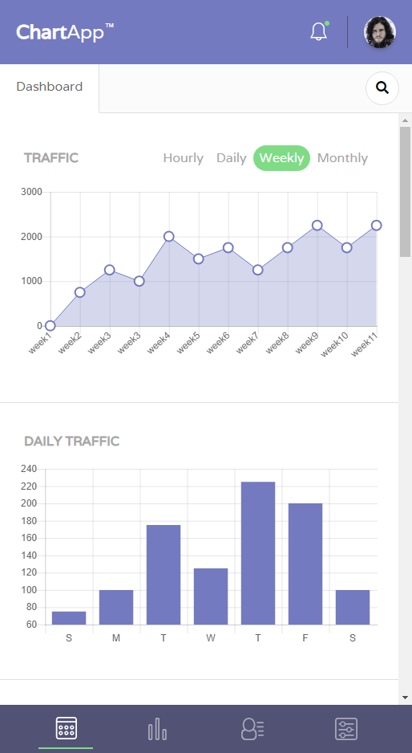
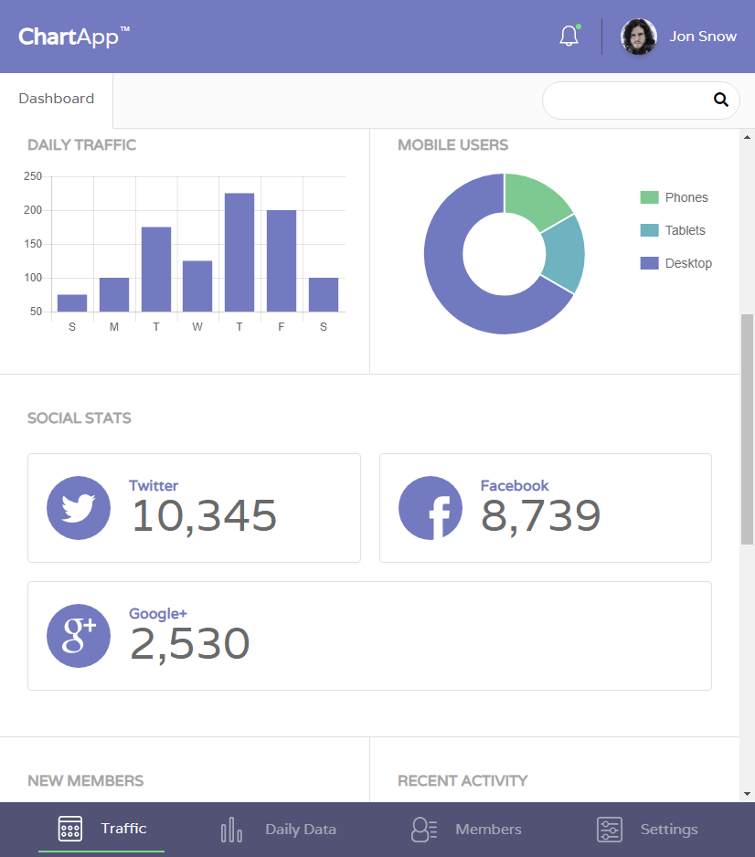
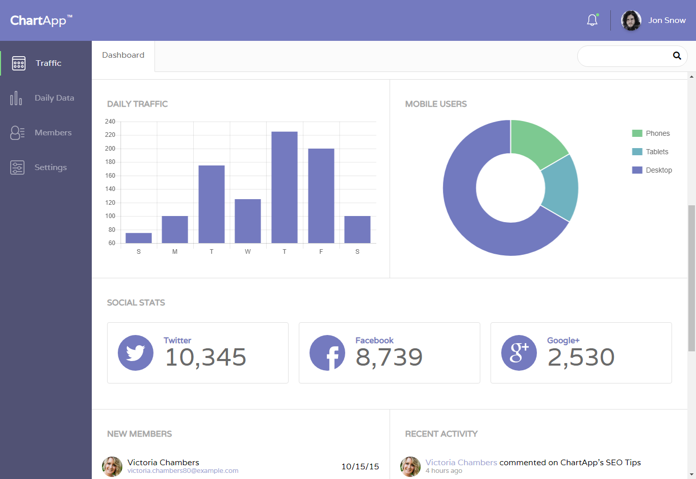

# A Chart App
This project is deployed with Github Pages, if you don't want to look at the source code, check it out [here](https://patrickmao93.github.io/techdegree-project-7/)  
This was the project #7 of the [Treehouse Front End Web Development Techdegree](https://teamtreehouse.com/techdegree/front-end-web-development-2).  
CSS Grid is just awesomeness. What even better is when combining CSS Grid with flexbox. These two tools really makes laying out web apps a breeze. Grid is incredibly versatile when it comes to 2D layouts, but sometimes I find it to be tedious when a container just contains several elements in one direction, and this is where flexbox comes in handy! In this project, you will see the combined power of CSS Grid and Flexbox, resulting in fully responsive page layouts.  
*Please note that this App interface is for front-end practice only. It does not have soul(back-end), so don't expect anything to actually work.*

## Instruction From Treehouse
> In this project, you'll take a mockup and a few icons and build a beautiful, web dashboard complete with JavaScript-driven charts and graphs. You only need to take the design and create the HTML, CSS and JavaScript functionality for this one page -- you don't need to create other pages, or build any backend or database functionality.

## Starter Content From Treehouse
- Mockup image for large screen size (width > 1024px)
- Icons (in SVG format)
- Placeholder images

## Libraries
- Chart.js

## Deliverable
- A fully responsive front-end of a fictional web dashboard app.

## Screenshots

Small Screen Size (320px ~ 767px)

    

Medium Screen Size (768px ~ 1023px)

    

Large Screen Size (> 1024px )

    

